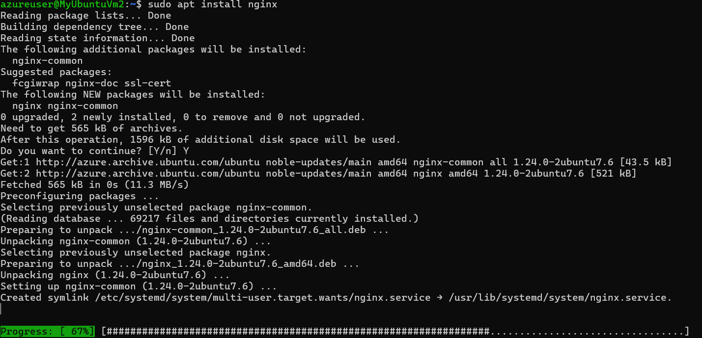
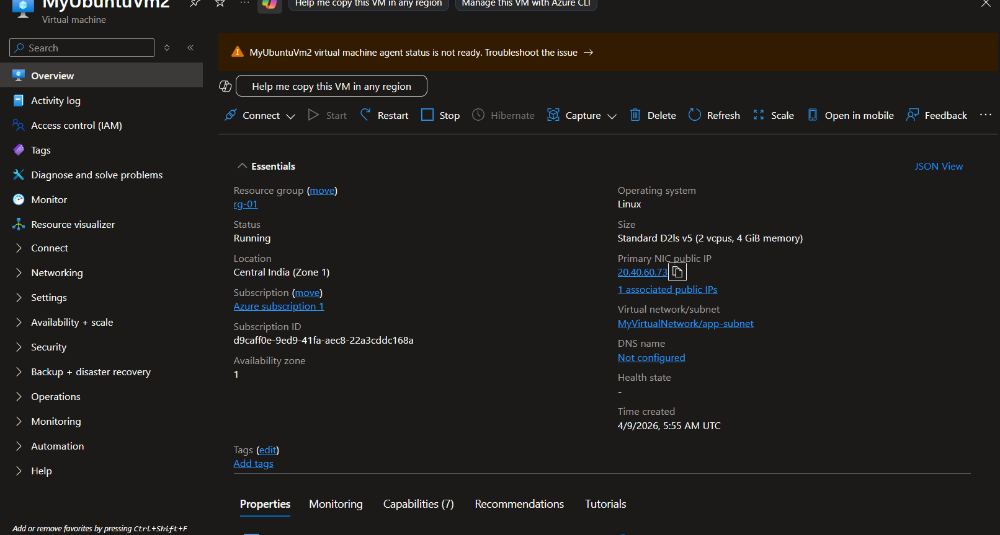

# Lab Report: Azure Virtual Network & Network Security Group (NSG) Implementation

**By:** Aaroh Gaur

## 1. Lab Objective

The objective of this lab is to architect a secure network environment in Azure by:

* Designing and implementing a segmented **Virtual Network (VNet)**.
* Configuring **Network Security Groups (NSGs)** to filter traffic between subnets.
* Leveraging **Application Security Groups (ASGs)** for scalable, name-based security rules.

---

## 2. Core Concepts

### 2.1 Virtual Network (VNet) & Subnets

A VNet is your private network in the cloud. It provides isolation but does not enforce traffic control by default. Subnets allow you to logically divide the VNet (e.g., Web, App, and Database tiers) to improve organization.

### 2.2 Network Security Group (NSG)

An NSG acts as a stateful firewall at either the **Subnet** or **Network Interface (NIC)** level. It uses a 5-tuple hash (Source, Source Port, Destination, Destination Port, Protocol) to allow or deny traffic.

### 2.3 Application Security Group (ASG)

ASGs allow you to group VMs logically. Instead of writing rules based on shifting IP addresses, you write rules based on the "role" of the server (e.g., "Allow App-Servers to talk to Web-Servers").

---

## 3. Implementation Phases

### Phase 1: Creating the Network Foundation

1. **VNet Provisioning:** Created `vnet-demo-lab` with address space `10.0.0.0/16` (65,536 available addresses).
2. **Subnet Segmentation:**
   * **web-subnet:** `10.0.1.0/24` (Reserved for web-facing workloads).
   * **app-subnet:** `10.0.2.0/24` (Reserved for internal application logic).

     

### Phase 2: Deploying Virtual Machines & Web Services

1. **Workload Deployment:** * Deployed `vm-web` in the `web-subnet`.
   * Deployed `vm-app` in the `app-subnet`.
2. **Web Server Setup:** Installed **NGINX** on `vm-web` and verified the service status:
   ```bash
   sudo apt update && sudo apt install nginx -y
   sudo systemctl status nginx
   ```
3. **Initial Access:** Added an inbound NSG rule to allow **Port 80 (HTTP)** to verify the NGINX default page via the public IP.



### Phase 3: Configuring Security Rules (NSG)

1. **NSG Creation:** Created `nsg-web` and attached it to the `web-subnet`.
2. **Rule Precedence Test:**
   * **Allow Rule:** Added `allow-http` (Port 80) with Priority 100. (Result: Success).
   * **Deny Rule:** Added `deny-http` (Port 80) with Priority 90.
   * **Observation:** The browser refresh failed. This proves that **lower priority numbers have higher precedence** in Azure.

### Phase 4: Advanced Security with ASGs

To move away from IP-based management, Application Security Groups were implemented:

1. **ASG Creation:** Created `asg-web` and `asg-app`.
2. **Association:** Linked `vm-web` to `asg-web` and `vm-app` to `asg-app` via their Network Interfaces.
3. **Clean Rule Logic:** Updated the NSG to allow traffic based on the ASG name:
   * **Source:** `asg-app`
   * **Destination:** `asg-web`
   * **Port:** 80
   * **Action:** Allow

     

---

## 4. Testing & Verification

| Test Scenario             | Action                                            | Expected Result                |
| :------------------------ | :------------------------------------------------ | :----------------------------- |
| **Public Access**   | Access `vm-web` Public IP via Browser           | **Denied** (Secure)      |
| **Internal Access** | `curl` from `vm-app` to `vm-web` Private IP | **Success** (Authorized) |
| **Priority Test**   | Set Deny rule to Priority 50 and Allow to 100     | **Traffic Blocked**      |

---

## 5. Summary: NSG vs. ASG

| Feature                    | NSG (Network Security Group)       | ASG (Application Security Group)                 |
| :------------------------- | :--------------------------------- | :----------------------------------------------- |
| **Primary Function** | Actual Firewall filtering traffic. | Logical grouping of Virtual Machines.            |
| **Rule Definition**  | Uses IP Addresses/CIDR ranges.     | Uses Tags/Labels (e.g., "asg-web").              |
| **Placement**        | Applied to Subnet or NIC.          | Used*inside* an NSG rule.                      |
| **Scalability**      | Complex to manage with many IPs.   | Highly scalable; labels stay same if IPs change. |

---

## 6. Conclusion

The lab successfully demonstrated that VNets alone are not security boundaries. By implementing **NSGs**, we enforced the principle of least privilege. The addition of **ASGs** simplified the administration, allowing for a "role-based" security architecture that is easier to maintain as the cloud environment grows.
