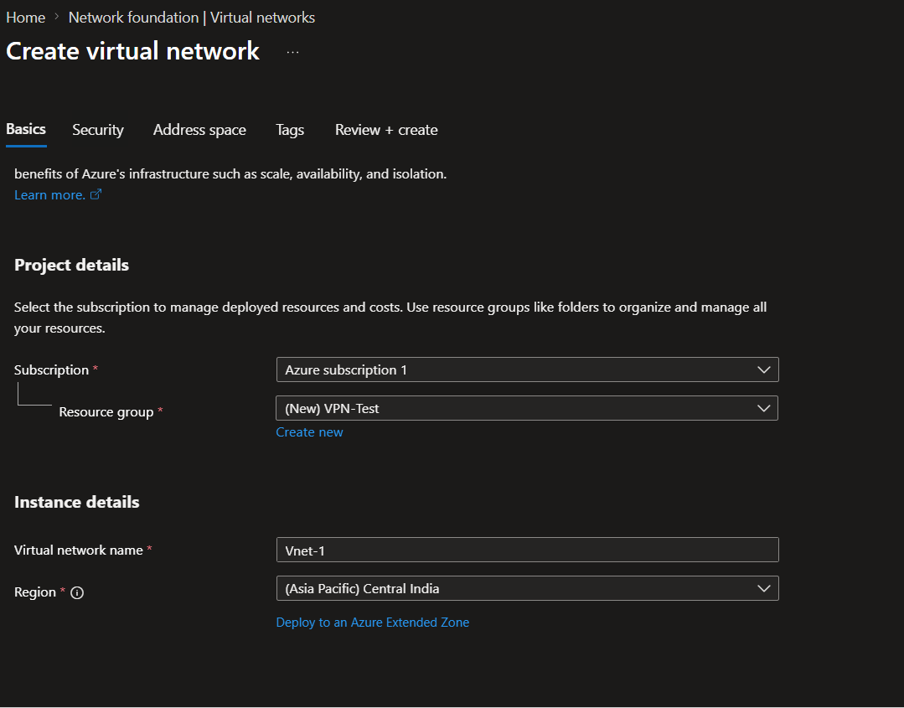
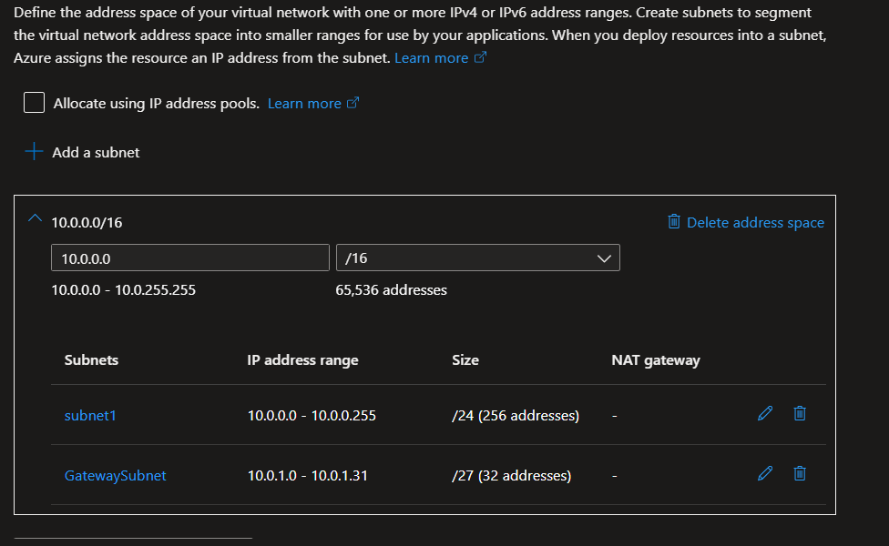
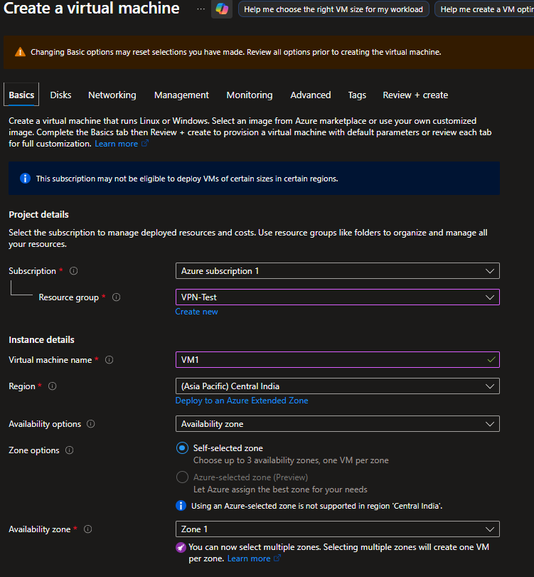
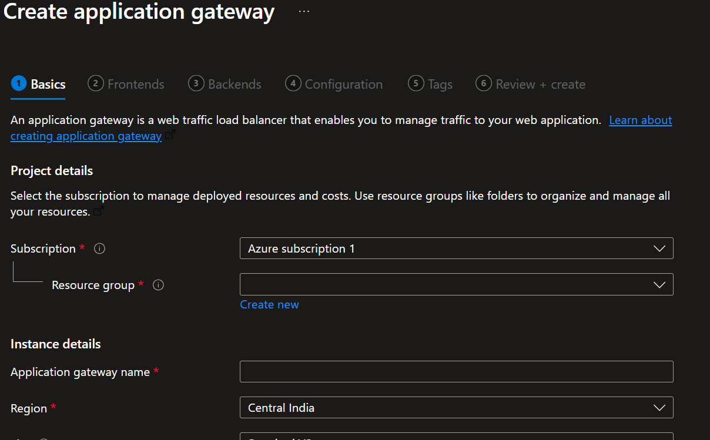
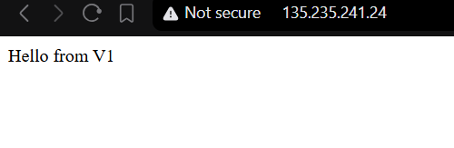

# Assessment: Implementing Azure Application Gateway (Layer 7 Load Balancing)

**By:** Aaroh Gaur

## 1. Assessment Objective

The objective of this lab is to deploy an **Azure Application Gateway** to manage and distribute incoming HTTP traffic across a pool of backend Virtual Machines. This demonstrates Layer 7 load balancing capabilities, ensuring high availability and traffic distribution via a Round-Robin mechanism.

---

## 2. Architecture Overview

The architecture consists of:

* **User (Browser):** Initiates requests via the Application Gateway's Public IP.
* **Application Gateway:** Acts as the entry point, operating at Layer 7 (Application Layer).
* **Backend Pool:** A collection of two Virtual Machines (**VM1** and **VM2**) running web servers (Nginx/IIS) to serve content.

---

## 3. Implementation Steps

### Step 1: Resource Group & VNet Setup

1. **Resource Group:** Created `rg-appgw-lab` in the **Central India** region.
2. **Virtual Network:** Provisioned `vnet-appgw` with a `10.0.0.0/16` address space.
3. **Subnets:**
   * **appgw-subnet (`10.0.0.0/24`):** Created as a dedicated subnet. *Requirement: Application Gateway must reside in its own subnet.*
   * **backend-subnet (`10.0.1.0/24`):** Created for hosting the workload VMs.

     

     

### Step 2: Backend VM Deployment

1. **Instances:** Deployed two Virtual Machines (`vm1` and `vm2`) into the `backend-subnet`.

   
2. **Web Server Configuration:** Installed Nginx and customized the landing pages:

   * **VM1 Command:** `echo "Hello from VM1" | sudo tee /var/www/html/index.html`
   * **VM2 Command:** `echo "Hello from VM2" | sudo tee /var/www/html/index.html`
3. **Networking:** Ensured Port 80 (HTTP) is allowed in the Network Security Group (NSG).

   

### Step 3: Application Gateway Provisioning

1. **Basics:** Named the resource `appgw-demo` using the **Standard v2** tier.
2. **Frontend:** Created a new Public IP named `appgw-pip`.
3. **Backend Pool:** Added `vm1` and `vm2` using their private IP addresses.
4. **Configuration (The "Three Pillars"):**

   * **Listener:** Set to Port 80 (HTTP) to receive external requests.
   * **HTTP Setting:** Configured to communicate with backends over Port 80.
   * **Routing Rule:** Created `rule1` to bind the Listener, HTTP Setting, and Backend Pool together.

   

---

## 4. Verification and Testing

### 4.1 Connectivity Test

1. Copied the **Frontend Public IP** from the Application Gateway overview page.
2. Navigated to `http://<App-Gateway-Public-IP>` in a browser.

### 4.2 Expected Results

Upon refreshing the browser, the output toggles between the two servers, demonstrating successful load balancing:

* **First Load:** `Hello from VM1`
* **Refresh:** `Hello from VM2`

  

---

## 5. Key Concept Summary

| Feature                          | Description                                                                       |
| :------------------------------- | :-------------------------------------------------------------------------------- |
| **Layer 7 Load Balancing** | Distributes traffic based on application-level data (HTTP/HTTPS).                 |
| **GatewaySubnet**          | A mandatory dedicated subnet for the gateway's managed instances.                 |
| **Round Robin**            | The default mechanism used to distribute traffic equally across the backend pool. |

---

## 6. Conclusion

The lab successfully demonstrated the deployment of an Azure Application Gateway. By isolating the gateway in a dedicated subnet and configuring a multi-VM backend pool, we achieved a scalable and highly available web architecture. This setup provides the foundation for advanced features like URL-path-based routing and Web Application Firewall (WAF) protection.
