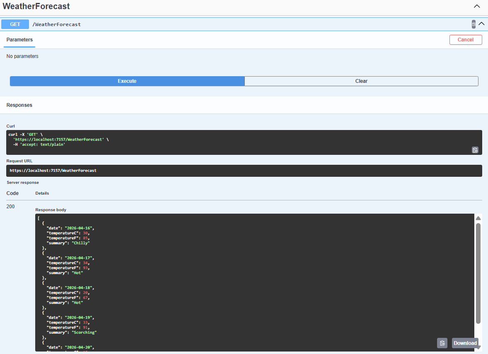
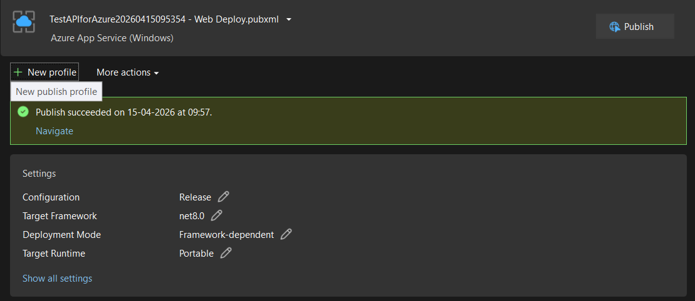
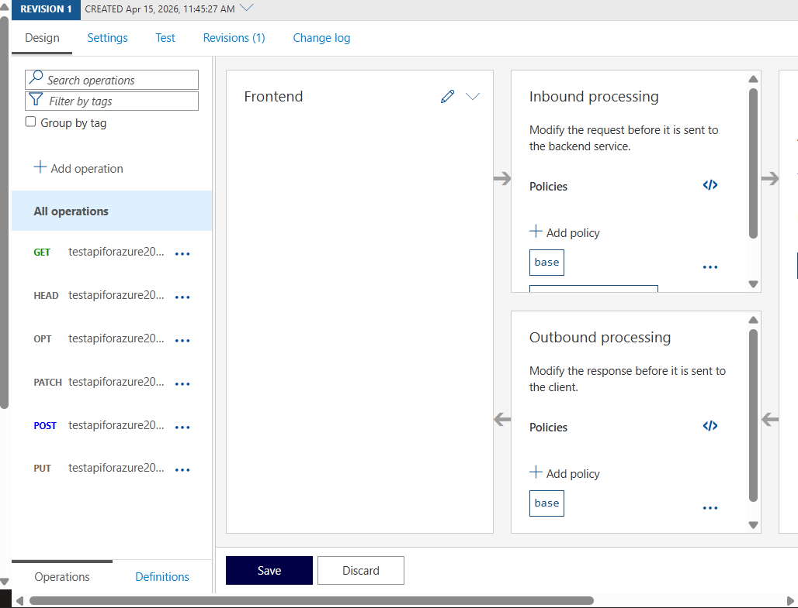
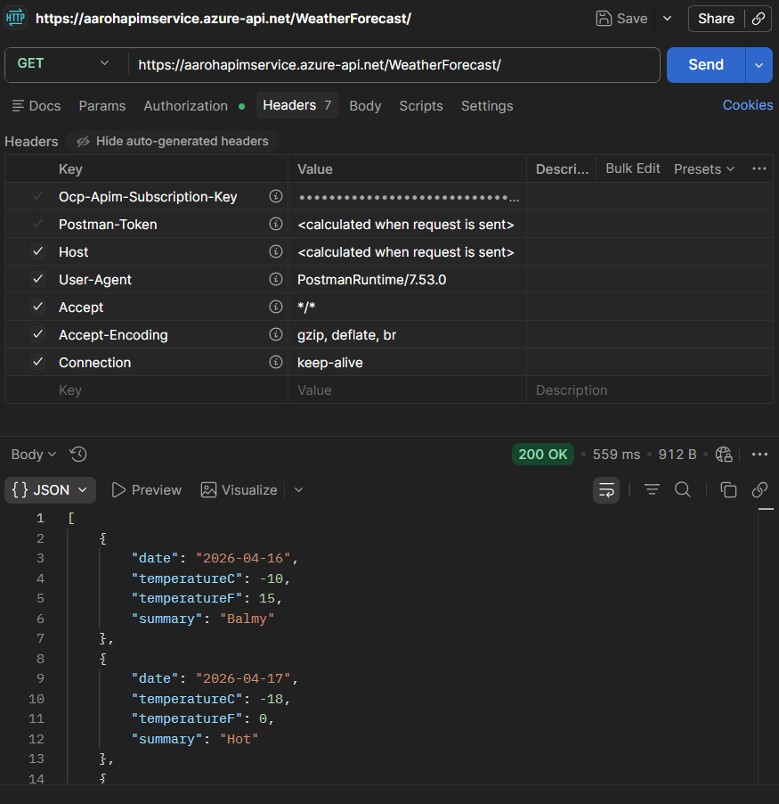
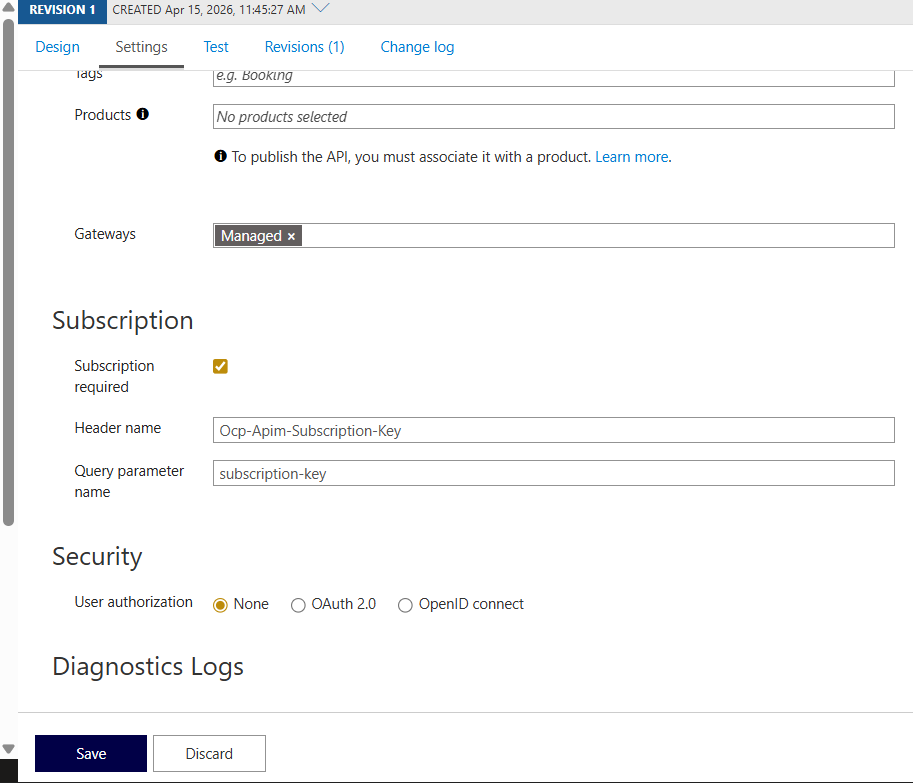
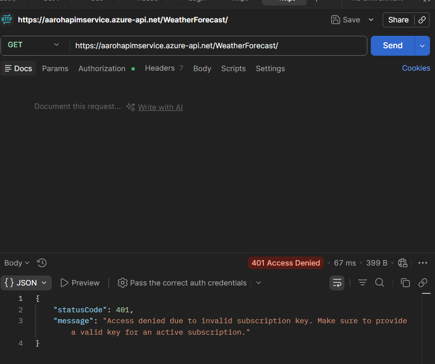
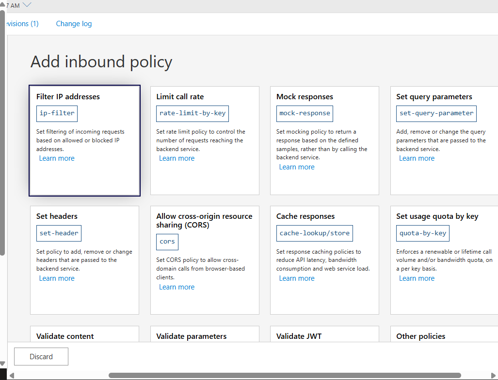
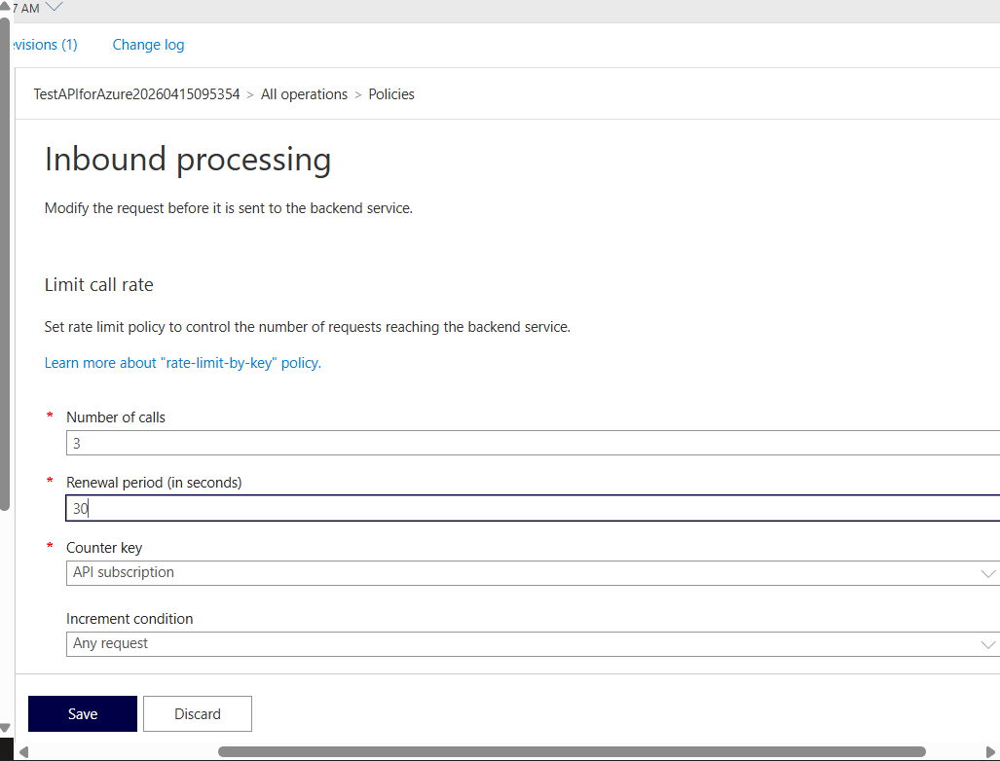

# Assessment: Publishing Web API to Azure with API Management (APIM)

**By:** Aaroh Gaur

## 1. Assessment Objective

The objective of this lab is to demonstrate the end-to-end lifecycle of an API: from local development in Visual Studio to cloud deployment using **Azure App Service**, and finally wrapping the API with **Azure API Management (APIM)** for security, rate limiting, and governance.

---

## 2. Implementation Workflow

### Phase 1: Local Development

1. **Project Creation:** Created a new **ASP.NET Core Web API** project in Visual Studio.
2. **Controller Setup:** Used the default `WeatherForecast` controller or a custom controller to ensure the API returns valid JSON data.
3. **Local Test:** Verified the API runs correctly on `localhost` using the Swagger UI.

   

### Phase 2: Publishing to Azure with APIM

1. **Publish Trigger:** Right-clicked the project in Visual Studio and selected **Publish**.
2. **Target Selection:** Selected **Azure** -> **Azure App Service (Windows/Linux)**.
3. **API Management Integration:**

   * During the publish wizard, clicked the **(+)** icon under the **API Management** section.
   * Configured the APIM instance name, resource group, and organization name.
   * **Note:** The API was automatically imported into APIM using the Open API (Swagger) definition during this step.
4. **Deployment:** Clicked **Publish** to deploy both the Web App and the APIM configuration.

   

---

## 3. Post-Deployment Verification (Azure Portal)

### 3.1 APIM Settings & APIs

* **APIM Settings:** Verified the Gateway URL and the status of the APIM instance in the Azure Portal.
* **APIs Added:** Navigated to the **APIs** blade in APIM to confirm that the Web API endpoints (e.g., `GET /WeatherForecast`) were successfully imported from the App Service.

  

### 3.2 API Endpoint Testing

* Used the **Test** tab within the APIM portal to send a request to the gateway.
* Confirmed a `200 OK` response, proving the Gateway is successfully proxying requests to the backend App Service.

  

---

## 4. Security & Governance Testing

### 4.1 Use of Subscription Keys

APIM uses Subscription Keys (`Ocp-Apim-Subscription-Key`) to authorize requests.

* **With Subscription Key:** Passed the key in the header. The API returned data successfully.
* **Without Subscription Key:** Attempted the request without the header. APIM returned `401 Unauthorized`, confirming the security layer is active.
* **Disabled Requirement:** Navigated to the API **Settings**, unchecked "Subscription Required," and saved. Verified the API now allows public access.





### 4.2 Applying Rate Limits (Throttling)

To protect the backend from being overwhelmed, a **Rate Limit** policy was applied.

1. **Policy Configuration:** Navigated to **Design** -> **Inbound Processing** -> **Policies**.
2. **XML Policy Applied:**

   ```xml
   <rate-limit calls="5" renewal-period="60" />
   ```
3. **Result:** After 5 rapid requests within a minute, APIM returned `429 Too Many Requests`, successfully throttling the traffic.

   

   

---

## 5. Summary Table

| Feature                    | Component       | Purpose                                                    |
| :------------------------- | :-------------- | :--------------------------------------------------------- |
| **App Service**      | Backend Hosting | Runs the actual .NET code.                                 |
| **APIM Gateway**     | Entry Point     | Provides a single URL for consumers and hides the backend. |
| **Subscription Key** | Authentication  | Ensures only registered clients can access the API.        |
| **Rate Limit**       | Policy          | Prevents API abuse and ensures fair usage.                 |

---

## 6. Conclusion

The integration of **Azure API Management** adds a critical layer of abstraction and security to the Web API. By enforcing subscription keys and rate limits, we ensure that the Student Management System (or any web service) is not only accessible but also protected against unauthorized access and traffic spikes.
