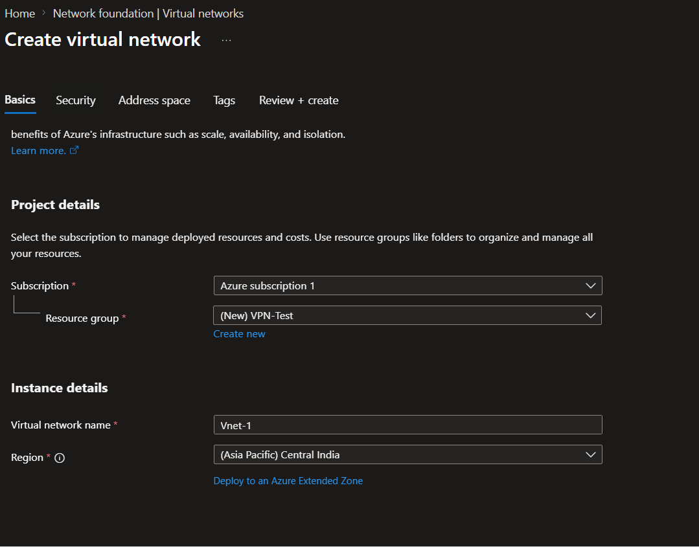
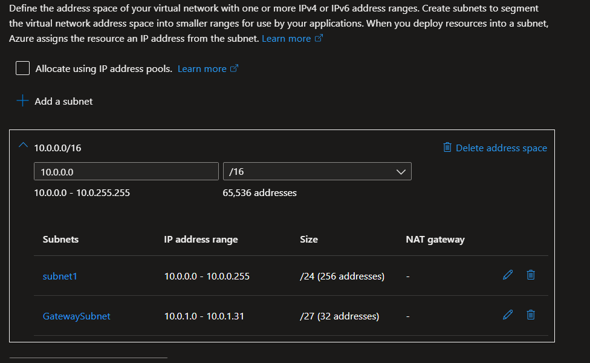
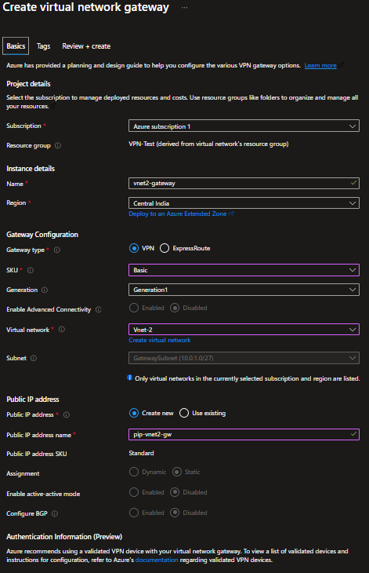
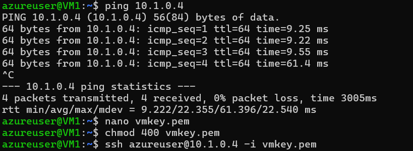
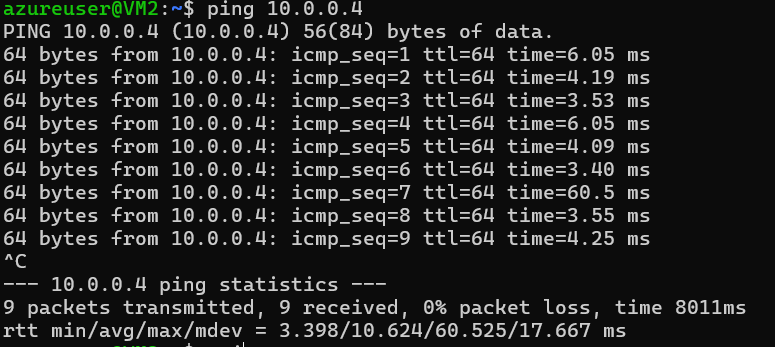

# Week-14 Assessment: Configuring VNet-to-VNet VPN in Azure

**By:** Aaroh Gaur

## 1. Assessment Objective

The objective of this lab is to connect two isolated Azure Virtual Networks (**VNet-1** and **VNet-2**) using a Site-to-Site style VPN (**VNet-to-VNet**). This creates a secure, encrypted IPSec tunnel over the Microsoft backbone, allowing resources in different networks to communicate using private IP addresses.

---

## 2. Core Concepts

### 2.1 The GatewaySubnet

The `GatewaySubnet` is a dedicated subnet reserved exclusively for Azure VPN Gateway instances.

* **Purpose:** Azure deploys managed gateway VMs into this subnet to handle encryption and routing.
* **Constraint:** It must be named exactly **“GatewaySubnet”**.
* **Constraint:** You cannot deploy your own Virtual Machines (VMs) in this subnet.

### 2.2 VPN Gateway & Public IP

The VPN Gateway acts as the "doorway" between networks. Although the traffic between VNets remains within the Azure infrastructure, the gateways use Public IPs to establish the encrypted IPSec/IKE tunnel.

---

## 3. Architecture Overview

* **VNet-1 (10.0.0.0/16):** Contains `Subnet1` (for VM1) and `GatewaySubnet` (for VPN Gateway 1).
* **VNet-2 (10.1.0.0/16):** Contains `Subnet1` (for VM2) and `GatewaySubnet` (for VPN Gateway 2).
* **The Tunnel:** A secure VNet-to-VNet connection linking Gateway 1 and Gateway 2.

---

## 4. Step-by-Step Implementation

### Step 1: Resource Group Creation

* **Action:** Created a resource group named `rg-vnet-vpn-lab`.
* **Region:** Central India (or your preferred region).

### Step 2: Virtual Network Configuration

* **VNet-1 Setup:**
  * **Address Space:** `10.0.0.0/16`
  * **Workload Subnet:** `subnet1` (`10.0.1.0/24`)
  * **Gateway Subnet:** `GatewaySubnet` (`10.0.255.0/27`)
* **VNet-2 Setup:**
  * **Address Space:** `10.1.0.0/16`
  * **Workload Subnet:** `subnet1` (`10.1.1.0/24`)
  * **Gateway Subnet:** `GatewaySubnet` (`10.1.255.0/27`)

### Step 3: Deploying Virtual Network Gateways

* **Gateway 1 (vnet1-gateway):**
  * **Type:** VPN | **VPN Type:** Route-based | **SKU:** VpnGw1.
  * **Public IP:** Created `pip-vnet1-gw`.
* **Gateway 2 (vnet2-gateway):**
  * **Type:** VPN | **VPN Type:** Route-based | **SKU:** VpnGw1.
  * **Public IP:** Created `pip-vnet2-gw`.
* **Note:** Deployment took approximately 25 minutes per gateway.

### Step 4: Establishing Bi-Directional Connections

To enable communication, two connection objects were created using a **Shared Key (PSK)**: `Azure123`.

1. **Connection 1:** `vnet1-to-vnet2` (Source: `vnet1-gateway` -> Destination: `vnet2-gateway`).
2. **Connection 2:** `vnet2-to-vnet1` (Source: `vnet2-gateway` -> Destination: `vnet1-gateway`).

### Step 5: Deployment of Test Workloads

* **VM1:** Deployed in `vnet1/subnet1`.
* **VM2:** Deployed in `vnet2/subnet1`.

---

## 5. Verification and Connectivity Test

### Test Results:

* **Source:** VM1 (Private IP: `10.0.1.x`)
* **Target:** VM2 (Private IP: `10.1.1.x`)
* **Command:** `ping 10.1.1.x`
* **Outcome:** The ping was successful, confirming that the VPN tunnel is encrypting and routing traffic between the two isolated VNets.

---

## 6. Conclusion

The lab successfully demonstrated the deployment of a VNet-to-VNet VPN. By utilizing the `GatewaySubnet`, we provided the necessary environment for Azure's managed gateway VMs to perform secure encryption (IPSec) and cross-network routing. This architecture ensures that sensitive data remains private while moving between different cloud environments.
